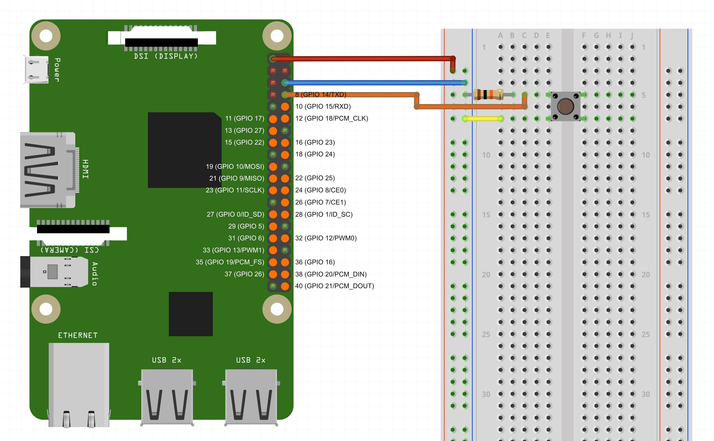

# Raspberry Pi Soundboard 

## Requirements/Parts

 * Raspberry Pi 2, 3, or 4 with Raspberry Pi OS. You can find the setup video [here](https://www.youtube.com/watch?v=NAqBgF0swYo).
 * Normally Open Push Buttons
 * 10k Resistor
 * Some cables (female-male, male-male)
 * Breadboard
 * Python Version `3.7.3+` installed

## Setup


### Software

* Download from [https://k0nze.gg/rpi_soundboard](https://k0nze.gg/rpi_soundboard)
* unzip and double click on `run.sh`

## Bundle + Zip with PyInstaller

Bundling has to take place on a Raspberry Pi

```bash
make zip
```

## Command Line

```bash
python3 -m pip install -r requirements.txt
python3 rpi_soundbar.py
```

## Credits
 Created by Konstantin (Konze) Lübeck

 * Discord: [discord.k0nze.gg](https://discord.k0nze.gg) 
 * Twitch: [twitch.tv/k0nze](https://twitch.tv/k0nze) 
 * Youtube: [youtube.com/k0nze](https://youtube.com/k0nze) 
 * Twitter: [twitter.com/k0nze_gg](https://twitter.com/k0nze_gg) 
 * Instagram: [instagram.com/k0nze.gg](https://instagram.com/k0nze.gg) 
